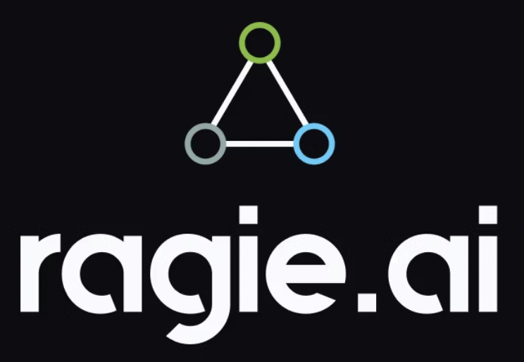

<p align="center">
  
</p>

<h2 align="center">RAG as a Service: secure Retrieval-Augmented Generation APIs for developers</h2>

<div align="center">

<a href="https://pypi.org/project/ragie/"></a>

<a href="https://opensource.org/licenses/MIT"></a>
<a href="https://docs.ragie.ai/docs/getting-started"></a>
<a href="https://discord.gg/wJnCeAmMpT"></a>

</div>

<h4 align="center">
    <p>
        <a href="https://docs.ragie.ai/docs/getting-started">Getting&nbsp;Started</a> |
        <a href="https://docs.ragie.ai/reference">API&nbsp;Reference</a> |
        <a href="https://docs.ragie.ai/docs/connections">Integrations</a> |
        <a href="https://ragie.ai">Ragie&nbsp;Platform</a>
    </p>
</h4>


## Table of Contents

- [Overview](#overview)
- [Why ragie?](#why-ragie)
- [Key Features](#key-features)
- [Tips, News, and Updates](#tips-news-and-updates)
- [SDK Installation](#sdk-installation)
- [Quick Start](#quick-start)
- [IDE Support](#ide-support)
- [Connections (Integrations)](#connections-integrations)
- [SDK Example Usage](#sdk-example-usage)
- [Available Resources and Operations](#available-resources-and-operations)
- [Pagination](#pagination)
- [File uploads](#file-uploads)
- [Retries](#retries)
- [Error Handling](#error-handling)
- [Server Selection](#server-selection)
- [Custom HTTP Client](#custom-http-client)
- [Authentication](#authentication)
- [Resource Management](#resource-management)
- [Debugging](#debugging)
- [Development](#development)
  - [Maturity](#maturity)
  - [Contributions](#contributions)


## Overview

ragie-python is the official Python SDK for Ragie: a managed Retrieval-Augmented Generation (RAG) platform. Instead of setting up vector databases, chunking strategies, or ingestion pipelines, Ragie gives you secure, production-ready RAG APIs that you can call directly from Python.

With ragie-python, you can:
- Upload and manage documents with metadata.
- Run semantic retrieval with optional reranking.
- Sync external sources (Google Drive, Notion, Confluence, etc.).
- Build RAG-powered apps in minutes: no infrastructure needed.


## Why Ragie?

- **Speed to value**: Go from zero to a functioning RAG system in minutes: no infrastructure to manage.  
- **Quality retrieval**: Metadata filters and optional reranking improve precision and relevance.  
- **Secure by design**: Bearer-token auth and server-side security for enterprise use cases.  
- **Flexible ingestion**: Many file types supported; update documents or metadata independently.  
- **Connectors**: Sync content from Google Drive, Notion, Confluence, and more with automatic updates.  
- **SDKs & integrations**: Official Python and TypeScript SDKs + LangChain, Mastra, and low-code platforms.  


## 🔥 Key Features

- **Documents**: Multiple file types, updatable content & metadata.  
- **Retrieval**: Semantic search, metadata filters, optional reranking.  
- **Connectors**: Google Drive, Notion, Confluence, etc., auto-sync.  
- **Ecosystem**: Python & TypeScript SDKs, LangChain, Mastra, low-code platforms.  


## 📰 Tips, News, and Updates

- Latest SDK version: see `RELEASES.md`.  
- Quick start guide: https://docs.ragie.ai/docs/getting-started  
- Join our community: https://discord.gg/wJnCeAmMpT  
- Need an integration? Let us know on Discord!  


## SDK Installation

> [!NOTE]
> Python version upgrade policy
>
> Once a Python version reaches its official end-of-life date, a 3-month grace period is provided for users to upgrade. Following this grace period, the minimum Python version supported in the SDK will be updated.
>
> The SDK can be installed with either pip or poetry package managers.

### PIP

```bash
pip install ragie
```

### Poetry

```bash
poetry add ragie
```

### Shell and script usage with uv

```bash
# Python REPL with Ragie available
uvx --from ragie python

# Run a script with Ragie dependency
uv run your_script.py
```


## 🚀 Quick Start

### 1) Authenticate

Ragie uses HTTP Bearer authentication:

```http
authorization: Bearer <your_api_key>
```

### 2) Ingest a document

Uploads a local file and creates a document; you can also attach metadata for filtering.

```python
from ragie import Ragie

with Ragie(auth="<YOUR_BEARER_TOKEN_HERE>") as client:
    res = client.documents.create(request={
        "file": {
            "file_name": "example.pdf",
            "content": open("example.pdf", "rb"),
        },
        # Optional metadata for later filtering
        # "metadata": {"department": "sales", "region": "emea"}
    })
    print(res)
```

### 3) Retrieve context for your query

Runs a retrieval query and returns ranked context chunks; you can optionally filter by metadata and enable reranking.

```python
from ragie import Ragie

with Ragie(auth="<YOUR_BEARER_TOKEN_HERE>") as client:
    res = client.retrievals.retrieve(request={
        "query": "What are the Q3 highlights?",
        # "filter": {"department": {"$in": ["sales", "marketing"]}},  # optional
        # "rerank": True                                              # optional
    })
    print(res.chunks)   # context suitable for an LLM
```


## IDE Support

### PyCharm

Generally, the SDK works well in most IDEs. For PyCharm, install the Pydantic plugin for improved model type-hinting and validation support:

- https://docs.pydantic.dev/latest/integrations/pycharm/


## Connections (Integrations)

ragie offers connectors that automatically sync documents from popular services:

- Google Drive  
- Notion  
- Confluence  
- and more  

See docs: [Connections](https://docs.ragie.ai/docs/connections)

This example lists source types, generates an OAuth redirect URL, creates a GCS connection, then triggers a sync.

Example workflow:

```python
from ragie import Ragie
import ragie

with Ragie(auth="<YOUR_BEARER_TOKEN_HERE>") as client:
    # 1) Discover source types
    print(client.connections.list_connection_source_types())

    # 2) (OAuth) Obtain redirect URL
    redirect = client.connections.create_o_auth_redirect_url()
    print("Visit:", redirect.url)

    # 3) Create a connection (example: GCS)
    conn = client.connections.create_connection(
        request=ragie.PublicCreateConnection(
            partition_strategy=ragie.MediaModeParam(),
            connection=ragie.PublicGCSConnection(
                data=ragie.BucketData(bucket="<your-bucket>"),
                credentials={"key": "<value>", "key1": "<value>"},
            ),
        )
    )
    print(conn.id)

    # 4) Trigger sync
    client.connections.sync(connection_id=conn.id)
```


<!-- End Table of Contents [toc] -->

<!-- Start SDK Installation [installation] -->
<!-- End SDK Installation [installation] -->

<!-- Start IDE Support [idesupport] -->
<!-- End IDE Support [idesupport] -->

<!-- Start SDK Example Usage [usage] -->
## SDK Example Usage

### Example 1

Create a document by uploading a file (sync).

```python
# Synchronous Example
from ragie import Ragie


with Ragie(
    auth="<YOUR_BEARER_TOKEN_HERE>",
) as r_client:

    res = r_client.documents.create(request={
        "file": {
            "file_name": "example.file",
            "content": open("example.file", "rb"),
        },
    })

    assert res is not None

    # Handle response
    print(res)
```

<!-- line removed -->

Create a document asynchronously.

The same SDK client can also be used to make asychronous requests by importing asyncio.
```python
# Asynchronous Example
import asyncio
from ragie import Ragie

async def main():

    async with Ragie(
        auth="<YOUR_BEARER_TOKEN_HERE>",
    ) as r_client:

        res = await r_client.documents.create_async(request={
            "file": {
                "file_name": "example.file",
                "content": open("example.file", "rb"),
            },
        })

        assert res is not None

        # Handle response
        print(res)

asyncio.run(main())
```

### Example 2

Create a connection (sync).

```python
# Synchronous Example
import ragie
from ragie import Ragie


with Ragie(
    auth="<YOUR_BEARER_TOKEN_HERE>",
) as r_client:

    res = r_client.connections.create_connection(request=ragie.PublicCreateConnection(
        partition_strategy=ragie.MediaModeParam(),
        page_limit=None,
        config=None,
        connection=ragie.PublicGCSConnection(
            data=ragie.BucketData(
                bucket="<value>",
            ),
            credentials={
                "key": "<value>",
                "key1": "<value>",
            },
        ),
    ))

    assert res is not None

    # Handle response
    print(res)
```

<!-- line removed -->

Create a connection asynchronously.
```python
# Asynchronous Example
import asyncio
import ragie
from ragie import Ragie

async def main():

    async with Ragie(
        auth="<YOUR_BEARER_TOKEN_HERE>",
    ) as r_client:

        res = await r_client.connections.create_connection_async(request=ragie.PublicCreateConnection(
            partition_strategy=ragie.MediaModeParam(),
            page_limit=None,
            config=None,
            connection=ragie.PublicGCSConnection(
                data=ragie.BucketData(
                    bucket="<value>",
                ),
                credentials={
                    "key": "<value>",
                    "key1": "<value>",
                },
            ),
        ))

        assert res is not None

        # Handle response
        print(res)

asyncio.run(main())
```

### Example 3

Create an authenticator (sync).

```python
# Synchronous Example
import ragie
from ragie import Ragie


with Ragie(
    auth="<YOUR_BEARER_TOKEN_HERE>",
) as r_client:

    res = r_client.authenticators.create(request={
        "provider": ragie.Provider.ATLASSIAN,
        "name": "<value>",
        "client_id": "<id>",
        "client_secret": "<value>",
    })

    assert res is not None

    # Handle response
    print(res)
```

<!-- line removed -->

Create an authenticator asynchronously.
```python
# Asynchronous Example
import asyncio
import ragie
from ragie import Ragie

async def main():

    async with Ragie(
        auth="<YOUR_BEARER_TOKEN_HERE>",
    ) as r_client:

        res = await r_client.authenticators.create_async(request={
            "provider": ragie.Provider.ATLASSIAN,
            "name": "<value>",
            "client_id": "<id>",
            "client_secret": "<value>",
        })

        assert res is not None

        # Handle response
        print(res)

asyncio.run(main())
```

### Example 4

Create an authenticator connection (sync).

```python
# Synchronous Example
import ragie
from ragie import Ragie


with Ragie(
    auth="<YOUR_BEARER_TOKEN_HERE>",
) as r_client:

    res = r_client.authenticators.create_authenticator_connection(authenticator_id="84b0792c-1330-4854-b4f2-5d9c7bf9a385", create_authenticator_connection=ragie.CreateAuthenticatorConnection(
        partition_strategy=ragie.MediaModeParam(),
        page_limit=None,
        config=None,
        connection=ragie.AuthenticatorDropboxConnection(
            data=ragie.FolderData(
                folder_id="<id>",
                folder_name="<value>",
            ),
            email="Aliyah_Feest59@yahoo.com",
            credentials=ragie.OAuthRefreshTokenCredentials(
                refresh_token="<value>",
            ),
        ),
    ))

    assert res is not None

    # Handle response
    print(res)
```

<!-- line removed -->

Create an authenticator connection asynchronously.
```python
# Asynchronous Example
import asyncio
import ragie
from ragie import Ragie

async def main():

    async with Ragie(
        auth="<YOUR_BEARER_TOKEN_HERE>",
    ) as r_client:

        res = await r_client.authenticators.create_authenticator_connection_async(authenticator_id="84b0792c-1330-4854-b4f2-5d9c7bf9a385", create_authenticator_connection=ragie.CreateAuthenticatorConnection(
            partition_strategy=ragie.MediaModeParam(),
            page_limit=None,
            config=None,
            connection=ragie.AuthenticatorDropboxConnection(
                data=ragie.FolderData(
                    folder_id="<id>",
                    folder_name="<value>",
                ),
                email="Aliyah_Feest59@yahoo.com",
                credentials=ragie.OAuthRefreshTokenCredentials(
                    refresh_token="<value>",
                ),
            ),
        ))

        assert res is not None

        # Handle response
        print(res)

asyncio.run(main())
```
<!-- End SDK Example Usage [usage] -->

<!-- Start Available Resources and Operations [operations] -->
## Available Resources and Operations

<details open>
<summary>Available methods</summary>

### [authenticators](docs/sdks/authenticators/README.md)

* [create](docs/sdks/authenticators/README.md#create) - Create Authenticator
* [list](docs/sdks/authenticators/README.md#list) - List Authenticators
* [create_authenticator_connection](docs/sdks/authenticators/README.md#create_authenticator_connection) - Create Authenticator Connection
* [delete_authenticator_connection](docs/sdks/authenticators/README.md#delete_authenticator_connection) - Delete Authenticator

### [connections](docs/sdks/connections/README.md)

* [create_connection](docs/sdks/connections/README.md#create_connection) - Create Connection
* [list](docs/sdks/connections/README.md#list) - List Connections
* [create_o_auth_redirect_url](docs/sdks/connections/README.md#create_o_auth_redirect_url) - Create Oauth Redirect Url
* [list_connection_source_types](docs/sdks/connections/README.md#list_connection_source_types) - List Connection Source Types
* [set_enabled](docs/sdks/connections/README.md#set_enabled) - Set Connection Enabled
* [update](docs/sdks/connections/README.md#update) - Update Connection
* [get](docs/sdks/connections/README.md#get) - Get Connection
* [get_stats](docs/sdks/connections/README.md#get_stats) - Get Connection Stats
* [set_limits](docs/sdks/connections/README.md#set_limits) - Set Connection Limits
* [delete](docs/sdks/connections/README.md#delete) - Delete Connection
* [sync](docs/sdks/connections/README.md#sync) - Sync Connection

### [documents](docs/sdks/documents/README.md)

* [create](docs/sdks/documents/README.md#create) - Create Document
* [list](docs/sdks/documents/README.md#list) - List Documents
* [create_raw](docs/sdks/documents/README.md#create_raw) - Create Document Raw
* [create_document_from_url](docs/sdks/documents/README.md#create_document_from_url) - Create Document From Url
* [get](docs/sdks/documents/README.md#get) - Get Document
* [delete](docs/sdks/documents/README.md#delete) - Delete Document
* [update_file](docs/sdks/documents/README.md#update_file) - Update Document File
* [update_raw](docs/sdks/documents/README.md#update_raw) - Update Document Raw
* [update_document_from_url](docs/sdks/documents/README.md#update_document_from_url) - Update Document Url
* [patch_metadata](docs/sdks/documents/README.md#patch_metadata) - Patch Document Metadata
* [get_chunks](docs/sdks/documents/README.md#get_chunks) - Get Document Chunks
* [get_chunk](docs/sdks/documents/README.md#get_chunk) - Get Document Chunk
* [get_chunk_content](docs/sdks/documents/README.md#get_chunk_content) - Get Document Chunk Content
* [get_content](docs/sdks/documents/README.md#get_content) - Get Document Content
* [get_source](docs/sdks/documents/README.md#get_source) - Get Document Source
* [get_summary](docs/sdks/documents/README.md#get_summary) - Get Document Summary

### [entities](docs/sdks/entities/README.md)

* [list_instructions](docs/sdks/entities/README.md#list_instructions) - List Instructions
* [create_instruction](docs/sdks/entities/README.md#create_instruction) - Create Instruction
* [update_instruction](docs/sdks/entities/README.md#update_instruction) - Update Instruction
* [delete](docs/sdks/entities/README.md#delete) - Delete Instruction
* [list_by_instruction](docs/sdks/entities/README.md#list_by_instruction) - Get Instruction Extracted Entities
* [list_by_document](docs/sdks/entities/README.md#list_by_document) - Get Document Extracted Entities

### [partitions](docs/sdks/partitions/README.md)

* [list](docs/sdks/partitions/README.md#list) - List Partitions
* [create](docs/sdks/partitions/README.md#create) - Create Partition
* [get](docs/sdks/partitions/README.md#get) - Get Partition
* [delete](docs/sdks/partitions/README.md#delete) - Delete Partition
* [set_limits](docs/sdks/partitions/README.md#set_limits) - Set Partition Limits


### [retrievals](docs/sdks/retrievals/README.md)

* [retrieve](docs/sdks/retrievals/README.md#retrieve) - Retrieve

</details>
<!-- End Available Resources and Operations [operations] -->

<!-- Start Pagination [pagination] -->

<a id="advanced-usage"></a>

## ⚙️ Advanced Usage

- [Pagination](#pagination)
- [File uploads](#file-uploads)
- [Retries](#retries)
- [Error Handling](#error-handling)
- [Custom HTTP Client](#custom-http-client)
- [Debugging](#debugging)

<!-- Advanced topics listed above; content starts below with Pagination -->

## Pagination

Some of the endpoints in this SDK support pagination. To use pagination, you make your SDK calls as usual, but the
returned response object will have a `Next` method that can be called to pull down the next group of results. If the
return value of `Next` is `None`, then there are no more pages to be fetched.

Here's an example of one such pagination call:
```python
from ragie import Ragie


with Ragie(
    auth="<YOUR_BEARER_TOKEN_HERE>",
) as r_client:

    res = r_client.documents.list(request={
        "filter_": "{\"department\":{\"$in\":[\"sales\",\"marketing\"]}}",
        "partition": "acme_customer_id",
    })

    while res is not None:
        # Handle items

        res = res.next()

```
<!-- End Pagination [pagination] -->

<!-- Start File uploads [file-upload] -->
## File uploads

Certain SDK methods accept file objects as part of a request body or multi-part request. It is possible and typically recommended to upload files as a stream rather than reading the entire contents into memory. This avoids excessive memory consumption and potentially crashing with out-of-memory errors when working with very large files. The following example demonstrates how to attach a file stream to a request.

> [!TIP]
>
> For endpoints that handle file uploads bytes arrays can also be used. However, using streams is recommended for large files.
>

```python
from ragie import Ragie


with Ragie(
    auth="<YOUR_BEARER_TOKEN_HERE>",
) as r_client:

    res = r_client.documents.create(request={
        "file": {
            "file_name": "example.file",
            "content": open("example.file", "rb"),
        },
    })

    assert res is not None

    # Handle response
    print(res)

```
<!-- End File uploads [file-upload] -->

<!-- Start Retries [retries] -->
## Retries

Some of the endpoints in this SDK support retries. If you use the SDK without any configuration, it will fall back to the default retry strategy provided by the API. However, the default retry strategy can be overridden on a per-operation basis, or across the entire SDK.

To change the default retry strategy for a single API call, simply provide a `RetryConfig` object to the call:
```python
from ragie import Ragie
from ragie.utils import BackoffStrategy, RetryConfig


with Ragie(
    auth="<YOUR_BEARER_TOKEN_HERE>",
) as r_client:

    res = r_client.documents.create(request={
        "file": {
            "file_name": "example.file",
            "content": open("example.file", "rb"),
        },
    },
        RetryConfig("backoff", BackoffStrategy(1, 50, 1.1, 100), False))

    assert res is not None

    # Handle response
    print(res)

```

If you'd like to override the default retry strategy for all operations that support retries, you can use the `retry_config` optional parameter when initializing the SDK:
```python
from ragie import Ragie
from ragie.utils import BackoffStrategy, RetryConfig


with Ragie(
    retry_config=RetryConfig("backoff", BackoffStrategy(1, 50, 1.1, 100), False),
    auth="<YOUR_BEARER_TOKEN_HERE>",
) as r_client:

    res = r_client.documents.create(request={
        "file": {
            "file_name": "example.file",
            "content": open("example.file", "rb"),
        },
    })

    assert res is not None

    # Handle response
    print(res)

```
<!-- End Retries [retries] -->

<!-- Start Error Handling [errors] -->
## Error Handling

[`RagieError`](./src/ragie/models/ragieerror.py) is the base class for all HTTP error responses. It has the following properties:

| Property           | Type             | Description                                                                             |
| ------------------ | ---------------- | --------------------------------------------------------------------------------------- |
| `err.message`      | `str`            | Error message                                                                           |
| `err.status_code`  | `int`            | HTTP response status code eg `404`                                                      |
| `err.headers`      | `httpx.Headers`  | HTTP response headers                                                                   |
| `err.body`         | `str`            | HTTP body. Can be empty string if no body is returned.                                  |
| `err.raw_response` | `httpx.Response` | Raw HTTP response                                                                       |
| `err.data`         |                  | Optional. Some errors may contain structured data. [See Error Classes](#error-classes). |
### Example

```python
import ragie
from ragie import Ragie, models


with Ragie(
    auth="<YOUR_BEARER_TOKEN_HERE>",
) as r_client:
    res = None
    try:

        res = r_client.documents.create(request={
            "file": {
                "file_name": "example.file",
                "content": open("example.file", "rb"),
            },
        })

        assert res is not None

        # Handle response
        print(res)


    except models.RagieError as e:
        # The base class for HTTP error responses
        print(e.message)
        print(e.status_code)
        print(e.body)
        print(e.headers)
        print(e.raw_response)

        # Depending on the method different errors may be thrown
        if isinstance(e, models.HTTPValidationError):
            print(e.data.detail)  # Optional[List[ragie.ValidationError]]
```

### Error Classes
**Primary errors:**
* [`RagieError`](./src/ragie/models/ragieerror.py): The base class for HTTP error responses.
  * [`ErrorMessage`](./src/ragie/models/errormessage.py): Unauthorized.
  * [`HTTPValidationError`](./src/ragie/models/httpvalidationerror.py): Validation Error. Status code `422`. *

<details><summary>Less common errors (5)</summary>

<br />

**Network errors:**
* [`httpx.RequestError`](https://www.python-httpx.org/exceptions/#httpx.RequestError): Base class for request errors.
    * [`httpx.ConnectError`](https://www.python-httpx.org/exceptions/#httpx.ConnectError): HTTP client was unable to make a request to a server.
    * [`httpx.TimeoutException`](https://www.python-httpx.org/exceptions/#httpx.TimeoutException): HTTP request timed out.


**Inherit from [`RagieError`](./src/ragie/models/ragieerror.py)**:
* [`ResponseValidationError`](./src/ragie/models/responsevalidationerror.py): Type mismatch between the response data and the expected Pydantic model. Provides access to the Pydantic validation error via the `cause` attribute.

</details>

\* Check [the method documentation](#available-resources-and-operations) to see if the error is applicable.
<!-- End Error Handling [errors] -->

<!-- Start Server Selection [server] -->
## Server Selection

### Override Server URL Per-Client

The default server can be overridden globally by passing a URL to the `server_url: str` optional parameter when initializing the SDK client instance. For example:
```python
from ragie import Ragie


with Ragie(
    server_url="https://api.ragie.ai",
    auth="<YOUR_BEARER_TOKEN_HERE>",
) as r_client:

    res = r_client.documents.create(request={
        "file": {
            "file_name": "example.file",
            "content": open("example.file", "rb"),
        },
    })

    assert res is not None

    # Handle response
    print(res)

```
<!-- End Server Selection [server] -->

<!-- Start Custom HTTP Client [http-client] -->
## Custom HTTP Client

The Python SDK makes API calls using the [httpx](https://www.python-httpx.org/) HTTP library.  In order to provide a convenient way to configure timeouts, cookies, proxies, custom headers, and other low-level configuration, you can initialize the SDK client with your own HTTP client instance.
Depending on whether you are using the sync or async version of the SDK, you can pass an instance of `HttpClient` or `AsyncHttpClient` respectively, which are Protocol's ensuring that the client has the necessary methods to make API calls.
This allows you to wrap the client with your own custom logic, such as adding custom headers, logging, or error handling, or you can just pass an instance of `httpx.Client` or `httpx.AsyncClient` directly.

For example, you could specify a header for every request that this sdk makes as follows:
```python
from ragie import Ragie
import httpx

http_client = httpx.Client(headers={"x-custom-header": "someValue"})
s = Ragie(client=http_client)
```

or you could wrap the client with your own custom logic:
```python
from ragie import Ragie
from ragie.httpclient import AsyncHttpClient
import httpx

class CustomClient(AsyncHttpClient):
    client: AsyncHttpClient

    def __init__(self, client: AsyncHttpClient):
        self.client = client

    async def send(
        self,
        request: httpx.Request,
        *,
        stream: bool = False,
        auth: Union[
            httpx._types.AuthTypes, httpx._client.UseClientDefault, None
        ] = httpx.USE_CLIENT_DEFAULT,
        follow_redirects: Union[
            bool, httpx._client.UseClientDefault
        ] = httpx.USE_CLIENT_DEFAULT,
    ) -> httpx.Response:
        request.headers["Client-Level-Header"] = "added by client"

        return await self.client.send(
            request, stream=stream, auth=auth, follow_redirects=follow_redirects
        )

    def build_request(
        self,
        method: str,
        url: httpx._types.URLTypes,
        *,
        content: Optional[httpx._types.RequestContent] = None,
        data: Optional[httpx._types.RequestData] = None,
        files: Optional[httpx._types.RequestFiles] = None,
        json: Optional[Any] = None,
        params: Optional[httpx._types.QueryParamTypes] = None,
        headers: Optional[httpx._types.HeaderTypes] = None,
        cookies: Optional[httpx._types.CookieTypes] = None,
        timeout: Union[
            httpx._types.TimeoutTypes, httpx._client.UseClientDefault
        ] = httpx.USE_CLIENT_DEFAULT,
        extensions: Optional[httpx._types.RequestExtensions] = None,
    ) -> httpx.Request:
        return self.client.build_request(
            method,
            url,
            content=content,
            data=data,
            files=files,
            json=json,
            params=params,
            headers=headers,
            cookies=cookies,
            timeout=timeout,
            extensions=extensions,
        )

s = Ragie(async_client=CustomClient(httpx.AsyncClient()))
```
<!-- End Custom HTTP Client [http-client] -->

<!-- Start Authentication [security] -->
## Authentication

### Per-Client Security Schemes

This SDK supports the following security scheme globally:

| Name   | Type | Scheme      |
| ------ | ---- | ----------- |
| `auth` | http | HTTP Bearer |

To authenticate with the API the `auth` parameter must be set when initializing the SDK client instance. For example:
```python
from ragie import Ragie


with Ragie(
    auth="<YOUR_BEARER_TOKEN_HERE>",
) as r_client:

    res = r_client.documents.create(request={
        "file": {
            "file_name": "example.file",
            "content": open("example.file", "rb"),
        },
    })

    assert res is not None

    # Handle response
    print(res)

```
<!-- End Authentication [security] -->

<!-- Start Resource Management [resource-management] -->
## Resource Management

The `Ragie` class implements the context manager protocol and registers a finalizer function to close the underlying sync and async HTTPX clients it uses under the hood. This will close HTTP connections, release memory and free up other resources held by the SDK. In short-lived Python programs and notebooks that make a few SDK method calls, resource management may not be a concern. However, in longer-lived programs, it is beneficial to create a single SDK instance via a [context manager][context-manager] and reuse it across the application.

[context-manager]: https://docs.python.org/3/reference/datamodel.html#context-managers

```python
from ragie import Ragie
def main():

    with Ragie(
        auth="<YOUR_BEARER_TOKEN_HERE>",
    ) as r_client:
        # Rest of application here...


# Or when using async:
async def amain():

    async with Ragie(
        auth="<YOUR_BEARER_TOKEN_HERE>",
    ) as r_client:
        # Rest of application here...
```
<!-- End Resource Management [resource-management] -->

<!-- Start Debugging [debug] -->
### Debugging

You can setup your SDK to emit debug logs for SDK requests and responses.

You can pass your own logger class directly into your SDK.

This routes HTTP request/response details through Python’s logging. Setting the level to `DEBUG` prints outbound request URLs, headers, timing, and responses—helpful for diagnosing authentication issues, timeouts, or custom client behavior.
```python
from ragie import Ragie
import logging

logging.basicConfig(level=logging.DEBUG)
s = Ragie(debug_logger=logging.getLogger("ragie"))
```
<!-- End Debugging [debug] -->

<!-- Placeholder for Future Speakeasy SDK Sections -->

# Development

## Maturity

This SDK is in beta, and there may be breaking changes between versions without a major version update. Therefore, we recommend pinning usage
to a specific package version. This way, you can install the same version each time without breaking changes unless you are intentionally
looking for the latest version.

## Contributions

While we value open-source contributions to this SDK, this library is generated programmatically. Any manual changes added to internal files will be overwritten on the next generation.
We look forward to hearing your feedback. Feel free to open a PR or an issue with a proof of concept and we'll do our best to include it in a future release.

SDK created by [Speakeasy](https://www.speakeasy.com/?utm_source=github&utm_medium=readme&utm_campaign=ragie-python-sdk)
